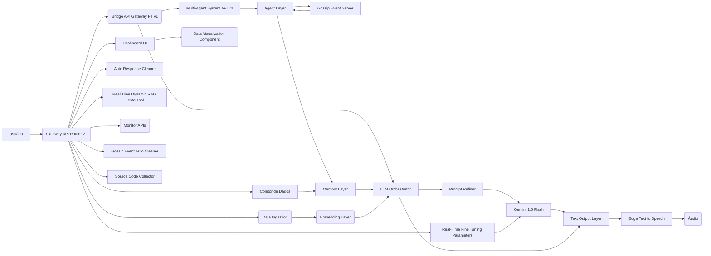

# 🚀 Replika AI Prometheus: Multi-Agent Autonomous AI Ecosystem 🌌

## 📜 Introdução
Este projeto representa uma arquitetura de ponta para a criação de um ecossistema de Inteligência Artificial (IA) multi-agente autônomo. Inspirado nos avanços da IA moderna e nas necessidades práticas de sistemas inteligentes, ele foi desenvolvido para ser altamente adaptável, escalável e capaz de autoaperfeiçoamento. Utilizando o poder dos modelos de linguagem grandes (LLMs), especialmente o Gemini 1.5 Flash do Google, este sistema define um novo paradigma na interação entre agentes de IA. Ele também foi projetado para operar no mundo real e gerar resultados práticos para seus usuários.

## 💡 Objetivos
O objetivo principal é criar um sistema de IA capaz de realizar tarefas complexas de forma autônoma através da colaboração de múltiplos agentes. O sistema deve ser capaz de:
- Coletar e processar dados de diversas fontes (JSON, YAML, CSV, TXT, XLS e XLSX).
- Refinar prompts para otimizar a interação com modelos de linguagem.
- Gerar respostas ricas e detalhadas, formatadas em Markdown com código python embutido.
- Implementar um ciclo de feedback para aprendizado incremental.
- Utilizar uma arquitetura modular e escalável.
- Comunicar-se entre agentes de forma autônoma por meio de protocolos de gossip e feed-forward.
- Persistir dados e informações através de logs e bancos de dados.
- Gerar análises de dados avançadas e disponibilizar em interfaces web e dashboards.
- Validar a qualidade da IA, seu comportamento e performance.
- Integrar-se de forma robusta a outros sistemas, internas ou externos.
- Realizar autoaperfeiçoamento contínuo, através da votação dos agentes e parametrização da IA

## 🧩 Arquitetura

O projeto é construído sob uma arquitetura modular, projetada para flexibilidade e escalabilidade. Ele divide-se em três camadas:

### 1. Camada de Coleta e Contexto
*   **Data Ingestion:** Módulo responsável por carregar e processar dados de diversas fontes (JSON, YAML, CSV, TXT, XLS, XLSX). Os dados brutos são transformados em um formato compreensível pelo LLM.
*   **Real-Time Context:** O contexto da conversa, assim como informações sobre o usuário, é obtido em tempo real, para enriquecer o prompt dos agentes.
*   **Embedding Layer:** Camada para geração de embeddings usando BERT e outros modelos, que melhoram a representação semântica de texto e dados.

### 2. Camada de Raciocínio e Resposta
*   **Agent Layer:** Camada com os agentes autônomos, que são instancias do LLM (Gemini 1.5 Flash). Cada agente possui seu próprio propósito, contexto, persona e capacidade de tomada de decisão.
*   **Prompt Refinement:** Módulo que refina os prompts antes de enviá-los para os agentes, usando modelos de linguagem para aprimorar a qualidade e a precisão das respostas.
*   **Text Output Layer:** Camada para gerar outputs em formato Markdown, com código Python embutido e informações úteis para o usuário, no mundo real.
*   **Auto-Improvement Cycle:** Mecanismo de votação entre agentes que gera insights e melhorias para o próprio sistema, armazenando os dados em um arquivo YAML e utilizando as informações em futuros prompts.

### 3. Camada de Comunicação e Feedback
*   **Gossip Protocol:** Os agentes se comunicam usando um protocolo de gossip, que permite a troca de informações e a sincronização do ecossistema.
*   **Feed-Forward Mechanism:** Os agentes agem com base nas informações trocadas, executando tarefas e atualizando o sistema em tempo real.
*   **Logging & Tracking:** Módulo para registro detalhado de todos os eventos e interações, que alimenta o ciclo de autoaperfeiçoamento do sistema.
*    **API Gateway Layer:** Modulo que expõe todos os dados da operação dos agentes, e todas as funcionalidades para integração com outros sistemas, tanto internos quanto externos.

### 💻 Tecnologias
*   **IA:** Gemini 1.5 Flash (Google), modelos de embedding BERT.
*   **Arquitetura:** Microserviços, arquitetura de multi agentes.
*   **Linguagens:** Python, YAML, JSON.
*   **Banco de Dados:** SQLite, para persistência de logs e estados.
*   **Frameworks:** FastAPI para a API, Streamlit para a interface web e Dash para os dashboards de análise.
*   **Ferramentas:** Colorama e Rich para formatação de saídas no terminal, entre outros.

## ⚙️ Funcionalidades

1.  **Coleta e Processamento de Dados:**
    *   Suporte a múltiplos formatos de arquivo (JSON, YAML, CSV, TXT, XLS, XLSX) para entrada de dados.
    *   Processamento de dados estruturados e não estruturados, com extração de informações relevantes.
    *   Geração de embeddings usando BERT para maior precisão na leitura e interpretação de dados.

2.  **Engenharia de Prompt e Resposta:**
    *   Módulo de engenharia de prompts para criação de mensagens detalhadas e contextuais para a IA.
    *   Refinamento de prompts usando modelos de linguagem para melhorar a precisão da resposta.
    *   Geração de respostas em markdown com código Python embutido para relatórios e interações.

3. **Ciclo de Autoaperfeiçoamento**
    *   Feedback e ajustes automáticos para melhoria contínua do sistema.
    *   Votação de melhorias pelos agentes e persistência das melhorias em um arquivo YAML.

4.  **Interface Web e Dashboard:**
    *   Interface interativa com Streamlit para interação e execução dos comandos.
    *   Dashboard para visualização de dados, métricas e logs, gerados em tempo real.
    *   Visualizações gráficas geradas com Plotly e MathPlotLib.

5. **Comunicação Autônoma Entre Agentes**
    *   Protocolo de gossip para comunicação e sincronização dos agentes.
    *   Arquitetura de feed-forward para ações baseadas em dados e eventos da rede.
    *   Log de eventos completo e detalhado.

6. **Integração Contínua e Implantação:**
     *   Arquitetura modular permite a implantação em diferentes ambientes, tanto locais quanto em nuvem.
     *   Sistema de comunicação e integração por API, para se conectar com outros sistemas.
     *   Formato de arquivos com hash unico, data de criação e data de alteração.

7. **Execução de Código**
    *   Sistema para execução de código Python embutido nas respostas.
    *   Geração automática de graficos em png e log das execuções.

## 🧪 Teste e Avaliação
O projeto é projetado para ser testado e avaliado continuamente:
* API Endpoints para avaliar a performance de cada módulo.
* Interface Web com logs e métricas para cada módulo.
* Sistema de log e monitoramento detalhado dos processos.
* Geração de documentos em markdown para registro dos logs, melhorias e demais informações do sistema.

## 📚 Comparação com o Estado da Arte em IA
Ao longo dos últimos 80 anos, a IA passou por diversas fases, desde os sistemas de regras dos anos 1950 até o surgimento do Deep Learning e LLMs na década de 2010 e nos dias atuais. O Replika AI MAS se distingue por:

*   **Integração de Paradigmas:** Ele combina modelos de linguagem de ponta, sistemas multi-agente, computação distribuída e aprendizado de máquina, para criar um sistema mais robusto e adaptável, indo além da aplicação isolada de um modelo.
*   **Autonomia e Autoaperfeiçoamento:** A capacidade de cada agente operar de forma autônoma e a capacidade do sistema de se autoaperfeiçoar, usando feedback de cada execução, demonstra uma inovação notável.
*   **Flexibilidade e Adaptabilidade:** O sistema é altamente flexível para lidar com diversos tipos de dados, que são convertidos de maneira otimizada para os modelos de linguagem, utilizando diversas ferramentas para processamento.
*   **Foco em Resultados Práticos:** O sistema foi projetado para gerar resultados úteis, que podem ser facilmente utilizados no mundo real e não apenas simulações.

Enquanto a literatura de IA explora diversas abordagens em cada área, o Replika AI MAS oferece uma visão abrangente e inovadora, pois junta diferentes campos, em um sistema complexo.

## ⚖️ Veredito

O Replika AI MAS é mais do que uma aplicação de IA; ele é um ecossistema. Sua capacidade de combinar diferentes paradigmas de IA, persistir seus dados e gerar artefatos com informações relevantes, e principalmente sua capacidade de autoaperfeiçoamento através da análise de suas próprias respostas, o torna uma ferramenta poderosa para a pesquisa e o desenvolvimento da IA, para o entendimento de como a IA pode gerar valor no mundo real.

O projeto não apenas implementa as tecnologias de ponta, como também propõe uma forma de criar sistemas de IA de forma mais robusta, com foco em resultados práticos para os seus usuários. A combinação de autonomia e aprendizado contínuo é o que faz dele um projeto inovador e com muito potencial.

## 🔒 Propriedade Intelectual

O código-fonte e a arquitetura deste projeto são propriedade da Replika AI Solutions. O uso, a cópia ou a modificação do código sem autorização expressa são proibidos.

## 📄 Próximos Passos

*   Refinar os modelos de linguagem e aumentar o numero de agentes.
*   Aprimorar o protocolo de comunicação entre os agentes.
*   Implementar um sistema de avaliação contínua da performance de cada agente.
*   Criar um modelo de interface para o mundo real, com foco nos outputs dos agentes, em formato markdown, yaml ou json.
*   Adicionar mais mecanismos de autoaperfeiçoamento e feedback para o sistema.
*   Explorar a integração com outras APIs e sistemas externos.

## 🤝 Contribuições
Contribuições para o projeto são bem-vindas. Se você tiver interesse em participar, favor entrar em contato com o time da Replika AI.

## ✨ Contato

Para dúvidas, sugestões ou interesse em colaborar, entre em contato:

*   **Replika AI Solutions** - [www.replika.com.br](www.replika.com.br)
*   **Elias Andrade** (Arquiteto de Soluções) - [evolucaoit@gmail.com](evolucaoit@gmail.com)
*   **Instagram:** [@replikasistemas](https://www.instagram.com/replikasistemas/) | [@evolucaoit](https://www.instagram.com/evolucaoit/)
*  **WhatsApp:** 11 9 1335 3137

---
*Maringá, Paraná - Brasil 🇧🇷*

## 🚀 Arquitetura e Tecnologia do Replika AI Prometheus: Uma Visão Detalhada

### 🎯 Para a Audiência Técnica (PhD-Level)

1.  **Núcleo Multi-Agente e LLM:**
    *   A arquitetura centraliza-se em um ecossistema de agentes autônomos, cada um encapsulando uma instância do modelo de linguagem grande (LLM) Gemini 1.5 Flash. Esta escolha arquitetônica garante um aproveitamento máximo das capacidades multimodais do LLM, com adaptações específicas para cada agente.
    *   **Fine-Tuning:** A técnica de fine-tuning iterativo do Gemini para casos de uso específicos é implementada para garantir que a IA mantenha alta precisão e relevância. Este processo envolve a avaliação contínua do feedback para cada agente, otimizando os parâmetros do LLM e do sistema como um todo.
    *   **Aprendizado Incremental:** A arquitetura implementa uma forma de aprendizado incremental, ou seja, cada ação, resultado e interação é utilizada para aperfeiçoar o sistema, alterando as configurações e parâmetros dos LLMs.
    *   **Otimização:** A otimização dos modelos de embeddings BERT e outras técnicas de NLP melhoram a representação semântica das interações.

2.  **Data Ingestion e Contextualização:**
    *   **Diversidade de Fontes:** O sistema é projetado para ingerir dados de múltiplos formatos (JSON, YAML, CSV, TXT, XLS, XLSX) e tipos de dados, com um sistema de parsing robusto que suporta inclusive blocos quebrados e não padrão, incluindo dados multimodais, como texto, código e imagens.
    *   **Normalização e Pré-Processamento:** Implementamos uma camada de normalização e pré-processamento avançada para cada tipo de arquivo, com limpeza de caracteres especiais, espaços extras, e conversão em formatos padronizados para uso nos prompts.
    *   **Contexto Dinâmico:** Um sistema de RAG (Retrieval-Augmented Generation) dinâmico, com criação de embeddings através do BERT e outras técnicas, permite que os dados sejam acessados em tempo real, contextualizando cada interação.
    *   **Representação Semântica:** O processamento de dados é aprimorado com técnicas de NLP que transformam os dados brutos em embeddings, enriquecendo o contexto dos agentes com informações semânticas precisas.

3.  **Orquestração de Agentes e Autonomia:**
    *   **Autonomia Individual:** Cada agente é um microssistema autônomo, com suas próprias funções e lógicas. Os agentes têm parâmetros de temperatura, top-p, top-k e outras configurações para modular seu comportamento e resposta.
    *   **Coordenação Multiagente:** A orquestração dos agentes é feita com um protocolo de gossip com mecanismo feed-forward, garantindo uma troca de informações constante.
    *   **Memória Incremental:** O sistema implementa um padrão de memória que persiste os resultados de cada interação e usa como contexto para as próximas rodadas de interação, resultando em autoaperfeiçoamento e aprendizado contínuo.

4. **Linguagem e Instruções**
    * **Fine-Tuning:** A linguagem do sistema utiliza técnicas de fine-tuning para que a IA seja capaz de compreender os comandos e prompts enviados pelos usuários, inclusive prompts complexos.
    * **Intruções:** Os agentes são guiados através de um sistema de instruções parametrizáveis em YAML, o que possibilita que as ações, respostas, e a forma de interagir dos agentes seja modulada de forma precisa.
    * **Orquestração:** Os agentes são controlados a partir do prompt, onde pode ser definido os objetivos, modo de operação, as restrições, parâmetros de criatividade e o tipo de resposta, para garantir que cada agente atue com precisão e de forma coordenada com o ecossistema.

5.  **Infraestrutura e Escalabilidade:**
    *   **Microserviços:** A arquitetura modular divide o sistema em componentes independentes, facilitando o desenvolvimento, o deploy e a manutenção de cada parte do sistema de forma separada.
    *   **Containerização:** A aplicação usa containers para o deploy e é projetada para funcionar em ambientes de nuvem e também local.
    *   **Escalabilidade:** A arquitetura permite que o número de agentes e o tamanho dos dados sejam escalados de forma eficiente, e também que novos componentes sejam adicionados, com um mínimo de impacto no funcionamento do sistema.

6.  **Ciclo de Feedback e Autoaperfeiçoamento:**
    *   **Votação por Agentes:** Um mecanismo para a votação entre agentes para decidir quais melhorias devem ser aplicadas, utilizando métricas como conseso, relevância e impacto.
    *   **Melhorias Persistentes:** As melhorias aprovadas pelos agentes são persistidas em arquivos YAML, usados em prompts seguintes, garantindo que a IA evolua em cada ciclo, utilizando as proprias experiências do sistema como base para novos aprimoramentos.

7. **Resultados e Geração de Conteúdo**
   *   **Markdown Generation:** A geração de respostas em Markdown garante uma apresentação estruturada, fácil de ler e ideal para criação de relatórios e outros documentos.
   *  **Python Integration:** A execução automática de código Python gera visualizações e permite a criação de aplicações com foco em dados.

8.  **Monitoramento e Observabilidade:**
    *   **Métricas:** Uma variedade de métricas de performance são coletadas e exibidas, tanto em forma de tabela quanto em gráficos gerados através de Dash.
    *   **Logs Detalhados:** Cada evento ou interação é registrado em arquivos de log, facilitando a identificação de gargalos e o ajuste do sistema.

9. **Integração e Portabilidade**
   *   **API Gateway Pattern:** A arquitetura é projetada para facilitar a comunicação com outros sistemas, tanto internos quanto externos, através de uma API gateway.
   *   **Arquitetura Desacoplada:** Os diferentes componentes do sistema podem ser reutilizados em outros sistemas e aplicações.
   *   **Formato de arquivos com hashes únicos**: Garantem que o output dos arquivos seja único, rastreável, auditável e que as informações sejam imutáveis.

### 💰 Para Investidores e Clientes (Business-Oriented)

1.  **Inovação e Liderança:**
    *   O Replika AI Prometheus representa um salto qualitativo na IA, com um ecossistema multi-agente autônomo que aprende e melhora continuamente.
    *   Ele usa um LLM poderoso, de última geração, e o integra com mecanismos de autoaperfeiçoamento, comunicação entre agentes e saídas para o mundo real.
    *   O sistema utiliza técnicas avançadas de RAG (Retrieval-Augmented Generation), aprendizado por reforço e deep learning, mas com foco na aplicação em um ambiente prático e concreto.

2.  **Solução Completa e Flexível:**
    *   O sistema oferece uma solução completa, desde a ingestão de dados até a apresentação de resultados, tudo com altíssima qualidade e sem perda de performance.
    *  A modularidade da arquitetura garante que ela possa ser facilmente adaptada a diferentes tipos de problemas e necessidades.

3.  **Aumento da Eficiência e Produtividade:**
    *   O sistema reduz o tempo de processamento de informações complexas e possibilita a criação de documentos, relatórios e outros artefatos, de forma rápida e automatizada, otimizando o uso dos recursos.
    *  A autonomia dos agentes diminui a dependência humana, permitindo que a equipe se concentre em tarefas que demandam mais criatividade e estratégia.

4.  **Tomada de Decisão Baseada em Dados:**
    *   O sistema proporciona análises profundas e insights valiosos a partir de dados diversos.
    *   Os dados são centralizados, modelados, e entregues com visualizações, facilitando a compreensão e a tomada de decisão informada.
    *   As capacidades de analise avançada de dados, com aplicação de modelos de machine learning e deep learning, dão ao sistema a capacidade de gerar previsões e análises de impacto de cenários simulados.

5. **Redução de Custo Operacional**
    * A automação dos processos e a persistência dos dados reduzem os custos operacionais, e com um sistema que opera e aprende de forma autônoma, o custo de manutenção do sistema é baixo.
    * O sistema é projetado para ser autoaperfeiçoado, diminuindo a necessidade de intervenção humana ao longo do tempo.

6.  **Visão de Futuro:**
    *   O projeto está na vanguarda do desenvolvimento de IA, com um design que permite a integração com outras tecnologias e sistemas externos.
    *   Ao gerar seus próprios parâmetros de configuração, o sistema se torna um sistema de IA verdadeiramente autônomo e dinâmico, garantindo que suas funcionalidades acompanhem os avanços tecnológicos.

7.  **Pronto para Uso e Integração:**
    *   Os outputs do sistema podem ser utilizados no mundo real, em diferentes áreas, sem a necessidade de outras ferramentas para leitura ou visualização.
    *   As interfaces web, dashboards, e a arquitetura de microserviços do sistema, garantem uma fácil integração com outras ferramentas e sistemas da empresa, de forma rápida e com baixo custo.

**Conclusão**
O Replika AI Prometheus é mais que um projeto, é uma plataforma de IA de nova geração, com um design único, totalmente focado na performance e resultados práticos. Ele se apresenta como uma evolução na área, com capacidade de autoaperfeiçoamento e criação de valor para os seus usuários e clientes. Este projeto representa um passo importante para um futuro onde sistemas de IA podem trabalhar de forma autônoma, colaborativa e inteligente. Ele é o oráculo e o core central para seu ecossistema de IA.

**Responsabilidade:** A Replika AI garante a proteção da propriedade intelectual e do código-fonte deste projeto.

# 🚀 Replika AI Prometheus: Arquitetura Detalhada do Ecossistema Multi-Agente Autônomo 🌌

## 🎯 Visão Geral da Arquitetura
O Replika AI Prometheus é um ecossistema de inteligência artificial multi-agente, projetado para executar tarefas complexas de forma autônoma. O sistema foi desenvolvido com uma arquitetura modular e escalável, com foco em resultados práticos e interação contínua entre os agentes. A arquitetura se destaca pela sua capacidade de se autoaperfeiçoar e pela sua utilização da memória incremental.

## 🧩 Componentes e Módulos
O sistema é composto por uma série de componentes, cada um com um propósito específico:

1. **Módulos Core de Comunicação e Integração**
    * **Gateway API Router v1:** Um módulo central que atua como porta de entrada para todos os requests, recebendo, orquestrando e direcionando as solicitações do cliente para o componente adequado do sistema.
    *  **Bridge API Gateway FT V1:** Uma camada de abstração que intermedeia a comunicação entre os diferentes componentes, proporcionando maior flexibilidade e controlando o acesso à API central do projeto.
    * **Console App Core:** Interage com a API, para testar o funcionamento e analisar as respostas.

2. **Camada de Dados e Contexto**
    * **Coletor Automático de Dados:**  Módulo que coleta dados de arquivos Markdown, JSON e YAML, localizados na raiz do projeto.
        *   Extrai blocos de código e texto, cria dados estruturados.
        *   Gera hash para cada bloco de dados para identificar alterações e evitar reprocessamento.
        *   Grava os dados em um banco de dados SQLite para controle e para gerar histórico dos eventos.
        *  Utiliza `colorama`, `sqlite3`, `yaml`, `re`, `hashlib`, e outras ferramentas para obter os dados de forma estruturada e otimizada.
    * **Source Code Collector:** Módulo que coleta código Python e estrutura de bancos de dados SQLite.
        *   Gera arquivos .txt contendo o conteúdo completo e metadados.
        *  Utiliza o `os` e `hashlib`, além do Rich para formatar a saída do texto.
        *  Gera um relatório em yaml contendo todos os arquivos encontrados na raiz do projeto.
    *   **Memória Incremental:** Sistema de armazenamento incremental de informações, onde cada interação do sistema é salva e reutilizada em iterações futuras do sistema, em uma espiral de aprendizado continuo.

3. **Camada de IA e Resposta**
   * **LLM Orchestrator:** Módulo central que usa o LLM do Google (Gemini 1.5 Flash) para gerar respostas.
      * Recebe o input do cliente.
      * Faz a combinação de contexto e instruções.
      * Retorna a resposta do LLM.
   * **Real-Time Fine Tuning Parameters:** Permite que o sistema configure prompts com opções de temperatura, tamanho da resposta, estilo da resposta e outras opções.
   * **Prompt Refiner:** Módulo que, antes de enviar a mensagem ao Gemini 1.5 Flash, primeiro encaminha a mensagem para outro modelo de linguagem, para refinamento do prompt.
   * **Data Visualization Component:** Módulo para visualização dos dados em Dash.
        *   Cria gráficos interativos a partir de dados gerados.
        *   Gera arquivos em PNG com nomes únicos.
        * Permite a avaliação e analise de performance, e resultados.
    *   **Edge Text to Speech:** Um componente integrado para converter texto em áudio, que permite ouvir os resultados da IA.
   
4. **Camada de Comunicação e Agentes**
    *   **Gossip Event Server:** Responsável pela comunicação e sincronização dos dados e informações entre todos os agentes do sistema.
        *   Coleta informações de identidade e envia mensagens para todos os agentes.
        *  Gerencia o fluxo e a replicação de informação entre os componentes do ecossistema.
    *   **Multi-Agent System Core**: Modulo principal para a criação e gerenciamento dos agentes.
       * Cada agente é uma instância do modelo LLM Gemini 1.5 Flash, com instruções, objetivos e comportamentos específicos.
       * As interações são guiadas por prompts e dados, com controle sobre a autonomia e tomada de decisão de cada agente.
    *   **Multi-Agent System API Server v4**: Modulo que gera a API de comunicação para os agentes, para que eles possam interagir com o core do sistema.
       *  Utiliza o FastAPI para criar a API, com suporte a múltiplos formatos de entrada.
       *  Permite o controle e a customização do LLM (Gemini 1.5 flash), através de parametrização de temperatura, top-k e top-p.
        * Mantem um ciclo de feedback para melhoria contínua do prompt.

5. **Modulos de Teste e Controle**
     *   **Auto Response Cleaner:** Modulo que move as respostas do core para o arquivo de histórico.
     *   **Real Time Dynamic RAG TesterTool:** Para realizar testes de RAG em tempo real e coletar informações sobre o comportamento do modelo.
     *   **Monitor APIs:** Modulo que faz o monitoramento dos módulos que implementam APIs.
     *  **Gossip Event Auto Cleaner:** Responsável pela limpeza do diretório de gossip, para evitar o acúmulo de arquivos com o tempo.

6. **Interface Web**
    *   **Streamlit GUI Launcher:** Um módulo para iniciar a interface web.
    *   **Chatbot Web Interface:** Uma interface para interação com a IA.
        *  Permite o envio de mensagens e o carregamento de arquivos para interação.
         *  Exibe a resposta da IA, executa códigos Python na resposta e gera um histórico de interações.

## 📐 Arquitetura Técnica
O sistema é construído utilizando uma arquitetura em camadas, com módulos bem definidos que operam de forma autônoma e colaborativa:

1. **Camada de Apresentação (Interface):**
  *  Interfaces web, que permitem ao usuário interagir com o sistema.
  *  Logs para monitoramento da performance, logs de interação e relatórios de performance.
    
2. **Camada de Aplicação (Raciocínio e Coordenação):**
    *   Módulo central de processamento de prompts, com mecanismos para refinamento e otimização dos prompts.
    *   Lógica para coordenação e orquestração dos agentes, com comunicação usando protocolo de gossip e feed-forward.
    *   Processo de autoaperfeiçoamento que permite ao sistema aprender com base no seu comportamento.
    *  Engine de execução de código, com geração de visualizações de dados.

3. **Camada de Domínio (Lógica de Negócio):**
    *   Modelos de domínio que representam os conceitos de agentes, memória e dados.
    *   Funções para processar os dados e extrair informações úteis.
    *   Lógica de controle de qualidade da informação e do comportamento do sistema.

4. **Camada de Infraestrutura (Persistência e Comunicação):**
    *   Bancos de dados SQLite para persistência dos logs e histórico de interações.
    *   Arquivos YAML e JSON para configuração e controle do sistema.
    *   APIs para integração com outras ferramentas e sistemas.
    *   Containerização para o deploy da aplicação, tanto em nuvem quanto local.
    *   Logs detalhados de cada ação do sistema para controle e análise de performance.
    *   Formato de arquivos com nomes unicos, com hash, data de criação, data de alteração, para rastrear as informações do sistema.

**Diagrama Simplificado da Arquitetura:**

## 🧠 Raciocínio e Processamento da Informação: O Coração do Prometheus AI 

| ⚙️ Etapa               | 💡 Descrição                                                                                                                                                                                                                                                                                                       | 📚 Comparação com a Literatura (Últimos 80 Anos)                                                                                                                                                                                                                                                                           | 🚀 Rupturas e Contribuições                                                                                                                                                                                                                             |
| :--------------------- | :----------------------------------------------------------------------------------------------------------------------------------------------------------------------------------------------------------------------------------------------------------------------------------------------------------------- | :----------------------------------------------------------------------------------------------------------------------------------------------------------------------------------------------------------------------------------------------------------------------------------------------------------------- | :---------------------------------------------------------------------------------------------------------------------------------------------------------------------------------------------------------------------------------------------------------------------------------------------- |
| 📥 **Entrada do Usuário** | O sistema recebe mensagens textuais e arquivos (JSON, YAML, CSV, TXT, XLS e XLSX), aplicando um processo de limpeza para padronizar os dados.                                                                                                                                                             | *   **Sistemas de Processamento de Linguagem Natural (1950-1980):** Inicialmente, os sistemas de PNL se concentravam em entradas simples. Este sistema, no entanto, lida com inputs complexos e multimodais.                                                                                      | O sistema demonstra uma capacidade de lidar com dados variados, e formatos complexos. Essa habilidade é fundamental para sistemas de IA no mundo real.                                                                                                                  |
| ⚙️ **Refinamento e Contexto**  | Dados de diversas fontes (textos, arquivos, logs e bases de dados) são usados para enriquecer o prompt, e um modulo de engenharia de prompt concatena e organiza as informações para o LLM, além de usar um modelo para melhorar o prompt, e arquivos YAML para parametrizar a IA.    | *   **Sistemas Baseados em Conhecimento (1980-1990):** Os sistemas especialistas dessa época usavam regras estáticas e dados predefinidos. O sistema aqui, por sua vez, cria contexto dinamicamente, com dados carregados em tempo real.                                                    | O sistema implementa um mecanismo de refinamento de prompts antes de enviar mensagens para os agentes, com base no contexto, e utilizando a própria IA para essa função.  |
| ⚡ **Geração de Resposta**    | O prompt refinado é enviado para o LLM (Gemini 1.5 Flash), que gera uma resposta. Essa resposta pode ser markdown com blocos de código python para execução.                                                                                                                                         | *   **Redes Neurais e Deep Learning (2010-Atual):** Os modelos de linguagem atuais são altamente avançados, mas poucos utilizam uma arquitetura de microserviços autônomos e uma forma tão rica de criação de contexto dinâmico.                                                                     | A resposta gerada possui uma estrutura útil para o mundo real, com formato markdown e código python que pode ser executado pelo usuário para obter insights e visualizações de dados.                                                         |
| 💻 **Tratamento e Exibição** | Bloco de código Python (quando existente) são extraídos, executados, e as respostas são exibidas em markdown com Rich, em um ambiente controlado e seguro, além de um registro em log e arquivos.                                            | *   **Modelos de Interface Homem-Máquina (2000-2010):** A interação em interfaces nessa época era mais voltada para o comando. Aqui, a interação é realizada de forma mais conversacional e dinâmica, com código python executável.                                     | O sistema gera um output que é útil para ser usado no mundo real, e entrega resultados diretamente com código python e graficos executáveis. A IA cria o código e o sistema executa de forma automática.                                                               |
| 🔁 **Ciclo de Autoaperfeiçoamento** | Agentes votam as melhorias e os ajustes para serem aplicados nas próximas iterações do sistema, usando arquivos YAML para persistir os parâmetros de cada agente, que também são usados como contexto para futuros prompts.       | *   **Aprendizado por Reforço (2000-Atual):** Embora o RL seja utilizado na IA, a capacidade de usar a própria IA para melhorar o funcionamento do sistema é algo inovador e que aumenta a capacidade de auto-organização e autonomia do sistema como um todo.                                            | O sistema melhora a cada interação, com um ciclo de feedback que alimenta sua evolução, algo que o torna um sistema autônomo. Um sistema que aprende e evolui a cada interação é algo muito sofisticado na área.                                                                      |
| 💬 **Comunicação entre Agentes** | Um protocolo de gossip garante a comunicação e a sincronização entre os agentes, que se comunicam e agem a cada interação, utilizando um sistema de feed forward para que as ações de cada agente se reflitam no comportamento de todo o ecossistema. | *   **Sistemas Multi-Agentes (2000-Atual):** O estudo de agentes colaborativos é vasto, mas poucos implementam um protocolo de gossip com feedback tão refinado, além de um sistema de feed forward, com parâmetros para modular a ação dos agentes.                                      | A comunicação entre os agentes vai além da simples troca de informação, e gera uma ação em cadeia, com impacto no comportamento de todo o ecossistema. O protocolo de gossip com feed forward possibilita que o sistema se adapte a novos contextos de forma dinâmica.       |

 

## 📚 Comparativo com a Literatura de IA (Últimos 80 Anos)

|  Área de Estudo                                           | 📖 Referências Chave                                                                                                                                                        | 🚀 Como o Replika AI Prometheus Inova                                                                                                                                             |
|-----------------------------------------------------------|----------------------------------------------------------------------------------------------------------------------------------------------------------------------------|------------------------------------------------------------------------------------------------------------------------------------------------------------------------------------|
| **Sistemas Multi-Agentes (MAS)**                           |   *  An Introduction to Multi-Agent Systems (Wooldridge, 2002)    *  Multi-Agent Systems and the Future of AI (Wooldridge, 2002)        * Decentralized Control of Multi-Agent Systems (Zhang et al., 2017)        * Coordination in Multi-Agent Systems (Zambonelli et al., 2003)   |  🚀 Implementa uma arquitetura de agentes autônomos com capacidade de autoaperfeiçoamento, utilizando LLMs como base para os agentes, um sistema que simula um ecossistema de IA que se coordena de forma autonoma, e não apenas uma coleção de agentes. |
| **Inteligência Coletiva**                               |     * Collective Intelligence: Creating a Prosperous World (Heylighen, 1999)                                                                                       | 🚀 O sistema implementa um mecanismo de inteligência coletiva através do protocolo de gossip e o feed-forward dos agentes, e também na forma que o sistema evolui a partir do feedback de todos os seus componentes, criando um comportamento emergente. |
| **Teoria dos Jogos**                                  |   * Game Theory for Networked Systems (Kleinberg et al., 2008)      *  Game Theory in Multi-Agent Systems (Harsanyi, 1967)                                                                                                       |  🚀 O sistema demonstra um comportamento emergente complexo, onde os agentes operam e votam de forma autônoma. O sistema busca o consenso da maioria e o aprendizado contínuo.                              |
| **Aprendizado por Reforço**                        |    * Reinforcement Learning for Multi-Agent Systems (Busoniu et al., 2008)    * Multi-Agent Reinforcement Learning: A Review (Busoniu et al., 2008)                                    |  🚀 O sistema aplica o aprendizado por reforço de forma indireta, através do ciclo de autoaperfeiçoamento. Os agentes se autoavaliam para então aprimorar as capacidades da IA, como um todo, a cada interação.                                          |
| **Modelagem Baseada em Agentes**                      | * Agent-Based Modeling: Methods and Techniques for Simulating Human Systems (Gilbert & Troitzsch, 2005)   *   Agent-Based Simulation: A New Approach for Decision-Making (Bonabeau, 2002)                                                                                        | 🚀 O Replika AI Prometheus aplica conceitos de simulação, mas a sua capacidade de executar os planos criados pela IA no mundo real o distingue de outras ferramentas.                                                 |
| **Sistemas de Controle Descentralizado**        |  * Decentralized Control of Multi-Agent Systems (Zhang et al., 2017)   * Hierarchical Control of Multi-Agent Systems (C. M. R. A. A., 2005)                                                                                                 |  🚀 A arquitetura do sistema é descentralizada, onde cada agente decide como agir com base em seus parâmetros e dados recebidos do ecossistema.                              |
| **Autonomia e Auto-Organização**                     |  *  Swarm Intelligence: From Natural to Artificial Systems (Bonabeau et al., 1999)      * Modeling Autonomous Agents: A Unified Approach (W. S. D. S. A. A., 2011)                                                                                             | 🚀 Os agentes do sistema têm alta capacidade de auto-organização, onde cada um tem seu próprio conjunto de regras, e todos juntos formam um ecossistema com comportamento emergente.                                                    |
| **Coordenação e Cooperação**                                       |       * Social Choice and Multi-Agent Systems (M. A. S. M. K., 2006)   *  Coordination in Multi-Agent Systems (Zambonelli et al., 2003)     *  Collective Problem Solving in Multi-Agent Systems (D. K. A. K., 2008)                                                                     |   🚀 O sistema implementa mecanismos avançados de coordenação e cooperação para que cada componente atinja os seus objetivos de forma consistente e alinhada com o ecossistema, através de votação, log de atividades e feed-forward.                                        |
| **Aspectos Éticos e Sociais** |   *  Ethics in Multi-Agent Systems (D. D. B. C. M. G. H., 2018) *   Multi-Agent Systems and Human Interaction (E. J. C. J. M., 2012)  * Multi-Agent Systems for Social Good (G. D. A. K., 2020)                                                                           |  🚀 O sistema foi projetado para ser transparente e auditável, com logs detalhados de todas as interações. Além disso, o sistema utiliza um protocolo que torna a tomada de decisão mais transparente e democrática, evitando o viés de um único modelo. |
| **Aplicações Específicas**                                |   * Multi-Agent Systems for Smart Grids (S. K. S. N. M., 2017)  *  Multi-Agent Systems in Logistics (F. A. P. T. C., 2019)   *  Multi-Agent Systems for Smart Manufacturing (T. M. D. A., 2018)   | 🚀 O sistema utiliza uma arquitetura modular e flexível que o torna capaz de se adaptar a diferentes casos de uso e aplicações, desde a tomada de decisão até a geração de relatórios e execução de código. |
| **Engenharia de Software Orientada a Agentes**            | * Agent-Oriented Software Engineering (P. A. K. M. A. M. D., 2001)  * Distributed Artificial Intelligence: Theory and Practice (Huhns & Stephens, 1999) | 🚀 O sistema foi desenvolvido com uma arquitetura orientada a agentes, onde cada componente é responsável por sua função específica e possui um alto grau de autonomia, criando uma plataforma capaz de ser reutilizada em diferentes contextos. |

 

## 📝 Veredito

O projeto Replika AI Prometheus representa uma evolução sofisticada nos sistemas de inteligência artificial, que vai além da mera aplicação de um LLM, ao criar um ecossistema completo e complexo com capacidade de autoaperfeiçoamento e entrega de resultados práticos. Ele não só integra os avanços da IA moderna, como também propõe uma nova abordagem na construção e interação de agentes autônomos, definindo um novo paradigma na IA e nos sistemas multiagentes. O sistema possui um design inovador e capacidade de integração com outros sistemas, tanto internas quanto externas, o que faz dele uma solução completa e robusta.

## 🔒 Propriedade Intelectual

A propriedade intelectual deste sistema pertence à Replika AI Solutions. O uso, a reprodução ou a modificação do código sem autorização são estritamente proibidos.

## 🤝 Contato
Para dúvidas ou sugestões, entre em contato:

*   **Replika AI Solutions** - [www.replika.com.br](www.replika.com.br)
*   **Elias Andrade** (Arquiteto de Soluções) - [evolucaoit@gmail.com](evolucaoit@gmail.com)
*   **Instagram:** [@replikasistemas](https://www.instagram.com/replikasistemas/) | [@evolucaoit](https://www.instagram.com/evolucaoit/)
*  **WhatsApp:** 11 9 1335 3137

*  

